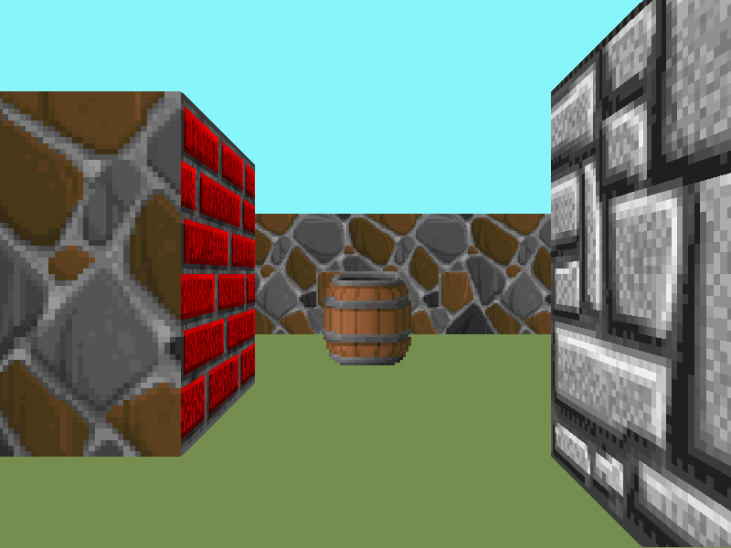

# Cub3D
### _Read the subject [here](../subjects/en.subject.pdf)_

``Cub3D`` est un programme qui utilise le Raycasting
Coder ce programme avait pour but d'apprendre le principe du Raycasting, ce qui a été fait durant ma formation à l'école 42.

### Instructions

* Utiliser la commande ``make`` pour compiler le programme
* Utiliser la commande ``./Cub3D map.cub`` pour lancer le programme
* WASD pour se déplacer, touches directionnelles Droite/Gauche pour orienter la caméra
* ESC pour quitter le progamme
* Textures sur les murs (Nord Sud, Ouerst, Est) ainsi que couleurs sur le Plafond/Sol
* Présence de sprites
